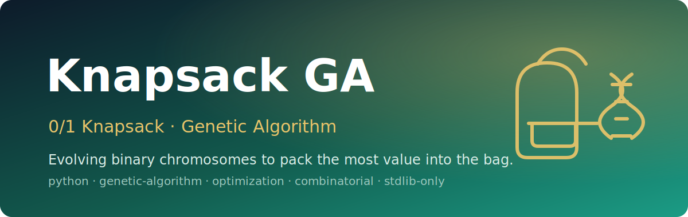

<p align="center">
  
</p>

<h1 align="center">Knapsack GA</h1>

<p align="center"><em>Evolving binary chromosomes to pack the most value into the bag.</em></p>

<p align="center">
  
  
  
  
  
</p>

A compact, dependency-free **Python** implementation of a **genetic algorithm** that solves the classic **0/1 Knapsack Problem**. Each candidate solution is a binary string where every bit decides whether an item goes into the bag. Over successive generations the population is **selected, recombined, and mutated** to converge on the item set that maximizes total value without exceeding the bag's weight capacity. It uses only the standard library (`math`, `random`) — no `pip install` required.

> A small, readable sandbox for understanding how evolutionary search tackles a combinatorial optimization problem.

---

## ✨ Features
- **Pure standard library** — runs on any Python 3.x install, nothing to install.
- **Binary chromosome encoding** — each item maps to one bit (`1` = take it, `0` = leave it).
- **Tournament selection, single-point crossover, and bit-flip mutation** implemented from scratch.
- **Elitist replacement** — children and parents compete; the fittest survive into the next generation.
- **Tunable knobs** — population size, items, bag capacity, tournament size, mutation rate, and generations are all top-level globals.

## 🏗️ How the GA works
The algorithm runs the canonical evolutionary loop for `max_gen` generations:

```text
initialise()      → random population of binary strings (one bit per item)
        │
        ▼
   ┌─────────────────────── generation loop (×100) ───────────────────────┐
   │  evaluate()       fitness = total value if weight ≤ bagSize, else 0   │
   │  parentSelect()   tournament selection, k = 2 candidates per pick     │
   │  recombine()      single-point crossover on parent pairs             │
   │  mutation()       bit-flip mutation, rate m = 0.1                     │
   │  survivorSelect() merge children + parents, keep top `populationSize` │
   └──────────────────────────────────────────────────────────────────────┘
        │
        ▼
  best_solution[0]   → fittest binary string after the final generation
```

- **Encoding:** a chromosome is a string like `"101010"`, one bit per item in `weightList` / `valueList`.
- **Fitness:** sum of selected items' values; any solution over `bagSize` is penalized to a fitness of `0`.
- **Replacement:** the merged pool of children and parents is sorted by fitness and truncated to the population size, keeping the strongest individuals.

## 🚀 Run it
The whole project is a single script with zero third-party dependencies.

```bash
git clone https://github.com/Usman1Abbas/Knap-Sack-using-genetic-algorithm-.git
cd Knap-Sack-using-genetic-algorithm-

# run the genetic algorithm (prints the best binary solution found)
python "KnapSack Using Genetic Algo.py"
```

Example output (the fittest chromosome — bits map to the items below):

```text
Best solution: 110010
```

## 🔧 Parameters
All parameters live as globals at the top of `KnapSack Using Genetic Algo.py`:

| Parameter        | Value                          | Meaning                                                  |
| ---------------- | ------------------------------ | -------------------------------------------------------- |
| `populationSize` | `10`                           | Number of candidate solutions per generation             |
| `weightList`     | `[1, 3, 7, 4, 5, 6]`           | Weight of each of the 6 items                            |
| `valueList`      | `[14, 23, 8, 9, 17, 15]`       | Value of each of the 6 items                             |
| `bagSize`        | `10`                           | Knapsack weight capacity (the hard constraint)           |
| `k`              | `2`                            | Tournament size for parent selection                     |
| `m`              | `0.1`                          | Mutation rate (per-bit flip probability)                 |
| `max_gen`        | `100`                          | Number of generations to evolve                          |

Edit these values to model a different knapsack instance or to tune the search — just make sure `weightList` and `valueList` stay the same length, since the chromosome width is derived from them.
